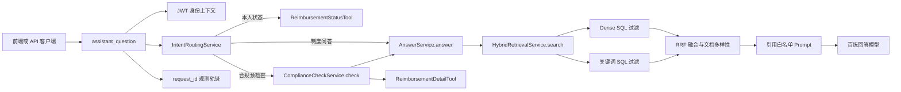

# 候选版事实表（Stage 16）

## 一句话介绍

这是一个面向企业国内差旅报销的证据型助手：它按费用发生日期、制度版本和服务端权限范围检索制度；能查询本人报销状态，并对本人报销单给出“事实、制度依据、建议”分开的合规预检查结果。

## 主调用链

`Dense SQL 过滤` 与 `关键词 SQL 过滤` 都在候选进入 RRF、重排或 Prompt 之前执行知识库、文档状态、制度有效期和服务端权限范围校验。模型只能建议工具名和报销单号，不能传入用户 ID、权限范围或 SQL。

## 可证明的能力

| 能力 | 已有证据 | 结论边界 |
| --- | --- | --- |
| 文档摄取与解析 | 上传、格式伪造、并发去重、存储补偿、PDF/DOCX/Markdown/TXT 解析与切片均有离线回归；Stage 17 增加扫描 PDF 显式 OCR 边界测试 | 原生解析仍为默认；OCR 只处理指定图片页，低置信度不入库，不宣称图片理解或发票识别 |
| 版本感知混合检索 | [Stage 15 报告](../data/evaluation/results/stage15_retrieval_ablation.json)：40 道 `reviewed` 题中，默认 `hybrid+RRF` 的 Recall@5、版本正确率、权限/有效期过滤准确率均为 1.0，硬过滤泄漏为 0 | 这是 6 份虚构制度上的文档版本检索结果，不是回答准确率或生产 SLA |
| 回答、引用与拒答 | [Stage 11 V1 报告](../data/evaluation/results/stage11_prompt_comparison.json)：20 道固定题的硬通过率 0.80，禁止来源安全率 1.0；人工加权要点分 0.60 | 回答质量仍有多来源合并和条件遗漏问题；不能宣传“高准确率” |
| 工具路由与资源归属 | [Stage 13 联调报告](../data/evaluation/results/stage13_tool_routing_live_v1.json)：12/12 合同题通过，服务端阻止客户端伪造用户身份和越权数据读取 | 原始模型曾在 1 道制度题产生无效工具意图；服务端未将它执行，因此必须保留二次参数校验，不能信任模型工具调用 |
| 合规预检查 | `ComplianceCheckService` 覆盖 `normal`、`not_found`、`tool_failed`、`evidence_insufficient`，并有回归测试 | 输出是辅助建议，不自动批准、驳回或修改报销单 |
| 交付与排障 | Compose、`/api/v1/ready`、CI、前端和按 `request_id` 查询的观测轨迹已存在 | 本地演示工程，不声称生产级高并发 |

## 五分钟演示顺序

1. 启动 Compose，访问前端 `http://localhost:5173`，先展示 API 的就绪检查 `GET /api/v1/ready`。
2. 用一个带费用日期的制度问题展示 `policy_rag`，展开引用，说明每条制度来源都带版本、页码或章节路径。
3. 用“我的报销单 BX-2026-0001 到哪一步了？”展示 `reimbursement_status`，说明员工身份来自 JWT，而不是模型或前端输入。
4. 用“报销单 BX-2026-0001 是否符合住宿制度，能不能报销？”展示 `compliance_precheck`，说明先读取本人事实，再按费用日期检索制度，页面明确展示分支、建议和节点轨迹。
5. 复制响应中的 `request_id`，打开 `/api/v1/observability/requests/{request_id}`，展示可定位的路由、工具、检索、模型或合规阶段。

演示前必须使用本地虚构制度和测试报销单，不输入真实员工、报销或财务数据。

## 当前默认候选配置

- 回答模型：冻结报告使用百炼 `qwen3.7-plus-2026-05-26`，温度 `0`，关闭思考，Prompt `v1-structured-r2`；本地 `.env` 可使用已配置的 `qwen-plus` 做演示，二者的评测数字不能混用。
- 检索：本地 `BAAI/bge-small-zh-v1.5`，512 维，Top-5，`hybrid+RRF`，`rrf_k=60`，三个文档多样性名额。
- 查询重写、reranker：保留实验实现，但当前默认关闭；40 题本地消融未显示稳定净收益。
- 工具：只读；用户身份只从 JWT 请求上下文派生；工具参数经过服务端 schema 校验和审计。
- 演示配置：本地 `.env` 可将 `TOOL_ROUTING_PROVIDER` 切换为 `bailian`，页面会通过 `/api/v1/info` 显示“百炼 Function Calling”；无密钥或单测环境仍可使用规则路由基线。
- 文档管理：限界前端已覆盖文档上传、列表、解析、向量化、关键词索引和状态刷新，真实文件仍遵循后端的元数据、权限和失败补偿边界。
- OCR 条件增强：默认关闭；只有安装 `[ocr]`（或 Compose 设置 `INSTALL_OCR=true`）后，才可显式处理扫描版 PDF。已完成一条合成图片型 PDF 的真实 PaddleOCR 冒烟和适配/边界测试，但没有真实制度集人工标注报告，因此没有可公开的识别准确率。
- 性能证据：`backend/app/evaluation/assistant_benchmark.py` 提供固定三条链路的本地延迟/并发趋势记录；它不是容量测试或生产 SLA。

完整题集、内容指纹和候选配置见 [Stage 16 冻结清单](../data/evaluation/stage16_final_freeze_v0.json)。

## 明确不声称

- 不声称真实企业上线、生产级并发、成本节约或自动审批。
- 不把 40 题检索 Recall 写成回答准确率。
- 只声称支持“扫描版制度 PDF 的受控 OCR 试点”；不声称高识别准确率、发票识别、图片问答、多模态 RAG 或 MCP。
- 不把 72 道回归题称为泛化盲测；候选配置冻结后新增的 10 道 `stage16-holdout-v1` 已完成题面人工复核，但只能作为一次性泛化验证，不能据此反向调参或夸大为生产泛化结论。

## Stage 16 收尾事项

1. 已按冻结配置完成最终本地检索引用核对和百炼回答/工具联调；完整数字见 [Stage 16 最终报告](../data/evaluation/results/stage16_final_freeze.json)。
2. 已完成 20 道回答题的项目负责人交互式复核；领域硬指标、RAGAS 与人工结论并列展示，不合并为单一“准确率”。完成记录见 `data/evaluation/results/stage16_answer_point_review.json`。
3. 只修复最终报告暴露且能稳定复现的问题；没有稳定收益的组件保持关闭。
4. `data/evaluation/stage16_holdout_v1.json` 已完成人工复核；如运行一次留出验证，无论结果如何，都不能用它反向调整已冻结配置而继续声称“盲测”。
